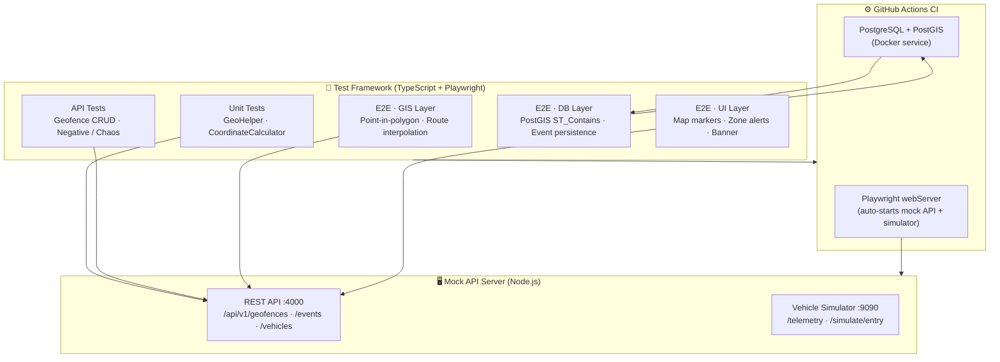

# ⚓ Alexandria Port — Intelligent Mobility & Geofencing Framework

[](https://github.com/extrago/mobility-geofencing-automation-framework/actions/workflows/playwright.yml)


> **Enterprise-grade test automation framework** for real-time vehicle tracking and spatial geofence enforcement at Alexandria Port, Egypt. Tests every layer of the system — from raw coordinate math to live UI alerts — using 96 automated tests across 4 browsers in under 2 minutes on CI.

---

## 🏗️ Architecture



---

## 🚀 Key Features

| Feature | Detail |
|---|---|
| **4-Layer Validation** | GIS math → REST API → PostGIS DB → Live UI — every layer independently verified |
| **Trajectory Simulation** | Vehicles move waypoint-by-waypoint; ENTRY events fire at exact boundary crossing |
| **PostGIS Spatial Queries** | `ST_Contains`, `ST_SetSRID`, `ST_GeomFromGeoJSON` — real server-side geometry |
| **Playwright webServer** | Mock API auto-started by Playwright — no manual server management in CI |
| **Cross-browser** | Chromium · Firefox · WebKit · Mobile Chrome — 96 tests, 4 browsers |
| **Allure Reporting** | Rich dashboards with history trends, screenshots, and video on failure |
| **Chaos / Negative Tests** | Invalid WGS84 coordinates, empty names, missing vehicles — all explicitly tested |

---

## 📂 Project Structure

```
├── src/
│   ├── api/            # GeofenceApiClient  (Axios)
│   ├── db/             # DbClient + spatialQueries (pg + PostGIS)
│   ├── fixtures/       # Playwright custom fixtures
│   ├── pages/          # MapPage, GeofencePanel (Page Objects)
│   ├── utils/          # GeoHelper, GIS utilities, env config
│   └── server.js       # Mock API :4000 + Vehicle Simulator :9090
├── tests/
│   ├── api/            # geofence.spec.ts · geofence.negative.spec.ts
│   ├── e2e/            # geofenceActivation · vehicleEnteringRestrictedZone · alexandriaTrajectory
│   ├── unit/           # geoHelper.spec.ts
│   └── fixtures/data/  # restrictedZone.json · vehicleRoute.json
├── .github/workflows/  # playwright.yml  (full CI pipeline)
└── playwright.config.ts
```

---

## 🖥️ Run Locally

### Prerequisites

| Tool | Version | Purpose |
|---|---|---|
| Node.js | ≥ 18 | Framework runtime |
| PostgreSQL | ≥ 14 | Database |
| PostGIS | ≥ 3.0 | Spatial geometry engine |
| Java (JDK) | ≥ 11 | Allure report engine |

### 1 — Clone & Install

```bash
git clone https://github.com/extrago/mobility-geofencing-automation-framework.git
cd mobility-geofencing-automation-framework
npm install
npx playwright install --with-deps
```

### 2 — Configure Environment

Create a `.env` file (or export these variables):

```bash
DB_HOST=localhost
DB_PORT=5432
DB_NAME=geofencing_db
DB_USER=postgres
DB_PASSWORD=your_password
API_BASE_URL=http://localhost:4000/api/v1
VEHICLE_SIMULATOR_URL=http://localhost:9090
```

### 3 — Initialize Database

```bash
psql -h localhost -U postgres -d geofencing_db -f src/db/schema.sql
```

### 4 — Run Tests

```bash
# All 96 tests (Playwright auto-starts the mock server)
npm test

# Specific browser only
npx playwright test --project=chromium

# Single spec file
npx playwright test tests/e2e/vehicleEnteringRestrictedZone.spec.ts

# Headed mode (watch the browser)
npx playwright test --headed
```

### 5 — View Reports

```bash
# Playwright HTML report
npx playwright show-report

# Allure report
allure generate allure-results --clean -o allure-report
allure open allure-report
```

---

## 🧪 Test Matrix

```
96 tests × 4 browsers = 384 total assertions  |  CI run time: ~2 minutes
```

| Suite | Tests | Layers Covered |
|---|---|---|
| `geofence.spec.ts` | 1 | API + DB |
| `geofence.negative.spec.ts` | 2 | API (chaos) |
| `geofenceActivation.spec.ts` | 6 | API + GIS + UI |
| `vehicleEnteringRestrictedZone.spec.ts` | 8 | GIS + API + DB + UI |
| `alexandriaTrajectory.spec.ts` | 1 | E2E trajectory |
| `geoHelper.spec.ts` | 6 | Unit (GIS math) |

---

## 👨‍💻 Author

<div align="center">
  <h3>Basem Abdelwahab</h3>
  <p><b>Senior QA Automation Engineer · Mobility & GIS Quality Specialist</b></p>
  <a href="https://www.linkedin.com/in/basemabdelwahab/">
    
  </a>
  <p>🚀 <b>Specialties:</b> Scalable Automation Architecture · Spatial Data Integrity · Enterprise CI/CD</p>
</div>